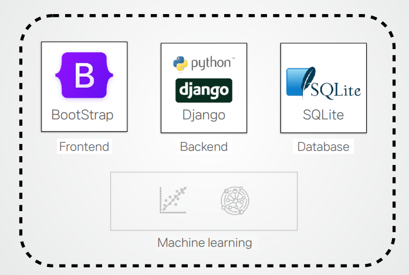

# 프로젝트 개요
  + 프로젝트 배경  
  기존의 부동산 서비스에 없는 인프라 기반 거주지역을 추천  
  + 프로젝트 내용  
  사용자가 원하는 인프라를 선택하면, AI모델을 통한 추천 5개동과 그에 해당하는 매물(적정가격) 제시  
# 아키텍쳐 및 기술 스택
  + 웹 서비스 아키텍쳐  
  
  + 기술 스택  
  
# AI 모델
## 인프라 기반 거주지역 추천 모델 (Clustering)  
  + 데이터셋 - 서울시 공공데이터  
  
    + 전처리 - 구간호(Binning), 표준화(Standardization), 차원축소(PCA)  
    
  + 학습
      + KMeans
      
      + KNN을 통한 군집 추천
      
## 전월세 가격 예측 모델 (Regression)
  + 데이터셋 - 서울시 공공데이터
  
    + 전처리 - One-hot 인코딩
    
  + 학습
    + 전세 - Lasso
    
    + 월세 - Poly Elastic
    
# 웹 서비스 개발

## 
- 💻 **https://youtu.be/--s3rMLrr3s**

**- 📮  Contact us -  
권혁준 : gurwns876@naver.com  
김정훈 : junghun2581@naver.com  
윤태호 : ice_98@naver.com  
이수종 : tnwhd1547@naver.com  
이정윤 : ghfy124533@gmail.com
정희원 : sheewons@naver.com
**
